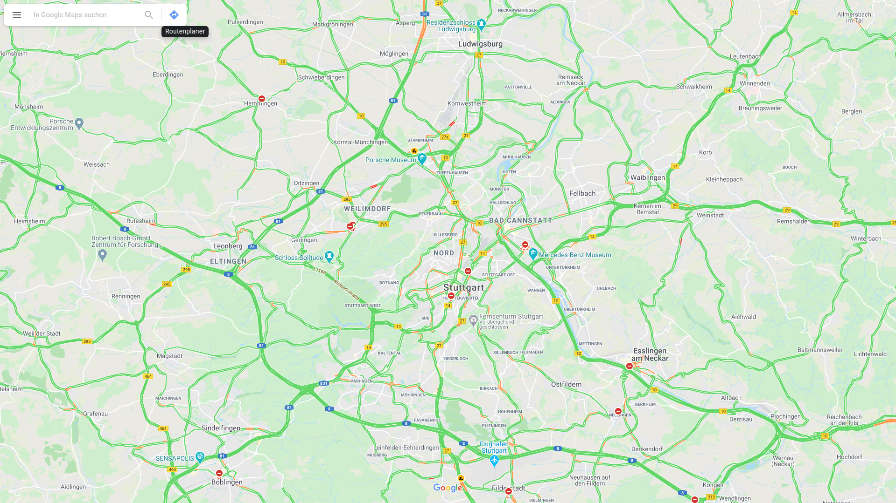

# Stuttgart Traffic Crawler

Shoots screenshots of google maps set to greater area of Stuttgart every 5 minutes and safes it to `/pics`.
The Map is centered to `48.7933017,9.1715786`. So it is using this URL: `https://www.google.de/maps/@48.7933017,9.1715786,12z/data=!5m1!1e1`. The Resolution is `1920 x 1080` pixels.

It is using basically [Puppeteer](https://github.com/puppeteer/puppeteer) via [browser-screen-grab](https://github.com/the-mod/browser-screen-grab).

Use scripts in `postproduction` directory to put a Header with Timestamp to every recorded Screenshot.

## Example

## Setup App

1. Install node.js and npm
2. Install dependecies `npm i`
3. `node index.js` to start the app

### Setup on Raspberry
`TODO`

## Mark Images with Timestamp

The Python Script is using ImageMagick to add the recorded Timestamp of the images

1. Install python
2. Install imagemagick
3. `python marker.py <your path to the images>` to start the script

## Create Video

1. Install ffmpeg
2. Execute `ffmpeg -framerate 5 -vcodec libx265 -i marked-%02d.png output.webm` to create a Video out of the captured Screenshots